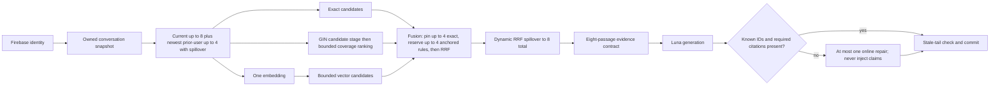

# P0 Conversation-Context Release Remediation Architecture Plan

**Status:** Complete in development qualification. The retained `v10` packet passes all nine P0
criteria in one immutable same-region artifact: retrieval recall 1.0, required-reference citation
coverage 0.9797979798, behavior 0.9669421488, citation validity 1.0, retrieval p95 322.348890 ms,
cached API p95 54.807516 ms, cache safety, telemetry, cleanup, and retained-evidence controls.
Production remains unchanged and outside this plan.
**Revision:** 23
**Last reconciled:** 2026-08-24
**Decision:** Keep the existing bounded, ownership-scoped conversation context. Repair the
retrieval, evidence, generation, and evaluation contracts that prevent valid follow-ups from
answering reliably. Do not change production under this plan.

**Revision 2 change:** Make prior-user projection explicitly recency-aware, require a measured
candidate-bounded lexical stage, describe the existing four-exact cap as dynamic RRF spillover,
and prohibit deterministic citation injection or evaluation-only repair behavior.

**Revision 3 change:** Record the authorized development deployment and failed one-shot capture,
add provider-output NUL sanitization after test-first diagnosis, and distinguish completed local
and deployment gates from the still-missing same-region retained evidence.

**Revision 4 change:** Record the separately authorized replacement image, update-only development
apply, successful zero-retry capture, immutable retained object, cleanup proof, authoritative
grading result, and final P0-AC-001 through P0-AC-009 evidence map.

**Revision 5 change:** Record the latest authorized development qualification, close the retained
latency failure, map every criterion to current code/local gates/retained evidence, and distinguish
the failed retained citation/context observations from the still-unreleased local `v6` candidate.

**Revision 6 change:** Record the residual retained-miss audit, narrow citation-required evidence
to explicit rule/card/definition targets, protect both pre-priority procedural branches within the
existing 12-term/50-row bounds, refresh local gates, and record the newly authorized one-shot
development qualification without consuming it.

**Revision 7 change:** Record failed build `d9f99669-6f73-48fe-a23b-8115e1acf29f`, prove that no
runtime image, Terraform apply, deployment, or capture followed it, and qualify the scale-aware
Playwright visual threshold with ten consecutive exact Linux Chromium passes.

**Revision 8 change:** Re-run the complete frontend gate in both the release Playwright image and
the exact `node:24-bookworm-slim` Cloud Build base with freshly installed browsers; record audit,
lint, coverage, PWA, and all 105 browser cases green without claiming a remote build or deployment.

**Revision 9 change:** Reconcile post-fix development state read-only: no newer Cloud Build, no
failed-build image tag, unchanged API/job digest and generation, and exactly six prior executions.

**Revision 10 change:** Record successful replacement build/publication, reviewed update-only
development apply, exactly one successful zero-retry capture, one create-only retained object,
cleanup and corpus-identity proof, authoritative negative grading, the resulting failed citation
and retrieval-latency gates, and the P0-AC-001 through P0-AC-009 evidence map.

**Revision 11 change:** Add the test-first local `v7` remediation, reduce the GIN anchor from 50 to
32 rows, project the seven retained misses to governing language without target rule IDs, add
bounded governing-parent coverage, weight current-question terms ahead of prior context, refresh
all local/build-equivalent gates, and explicitly retain the missing changed-candidate same-region
proof.

**Revision 12 change:** Make the evaluation OpenAI client zero-transport-retry under a focused
RED/GREEN test, refresh the complete host and Python 3.12 gates to 284 tests, and record the fresh
one-cycle development qualification authorization without consuming it.

**Revision 13 change:** Record the one authorized `v7` Cloud Build failure, prove that no image,
plan/apply, deployment, execution, or retained object followed it, and harden Playwright through
RED/GREEN configuration tests plus exact Linux contention and full-matrix evidence.

**Revision 14 change:** Record the separately authorized single build retry, its eight green Cloud
Build gates and immutable published digest, prove that deployment/execution/object inventories did
not change, and leave the Terraform/apply/capture boundary pending separate explicit authorization.

**Revision 15 change:** Record the authorized hash-pinned update-only apply, Ready `v7` service/job
definitions, exactly one zero-retry same-region execution, one generation-pinned create-only
object, cleanup and corpus-identity proof, authoritative negative citation grade, and the final
P0-AC-001 through P0-AC-009 evidence map.

**Revision 16 change:** Add the post-capture `v8` RED/GREEN remediation, promote one governing rule
per domain anchor branch, require contextual linked abilities and both pre-priority procedures,
rotate prompt/retrieval cache boundaries, record real-corpus and complete local gates, and restore
the missing changed-candidate build/deployment/capture and same-region latency proof.

**Revision 17 change:** Record the completed authorized `v8` build, reviewed update-only apply,
exactly one zero-retry retained capture, cleanup, immutable object, and negative citation/latency
grade; add the test-first `v9` governing-parent and exact-lookup concurrency remediation; refresh
the AC-001 through AC-009 map and the remaining same-region proof.

**Revision 18 change:** Record the authorized `v9` build, reviewed hash-pinned update-only apply,
exactly one zero-retry retained capture, cleanup and corpus identity, and canonical grade; close the
correctness gaps but retain the 525.002083 ms latency failure. Add the test-first local `v10`
embedding/text-path overlap, cache-cancellation contract, 300-test local gates, read-only corpus
diagnostic, and the exact remaining same-region proof boundary.

**Revision 19 change:** Harden every concurrent retrieval join so a failed or cancelled sibling is
cancelled and drained; add RED/GREEN failure-path coverage; and prove that Hybrid and evaluator
paths start HNSW on embedding readiness while Ask starts it after a semantic-cache miss, all without
waiting for exact/GIN completion. Complete
the 305-test local Cloud Build equivalent matrix: Python 3.12 backend gates, frontend
audit/coverage/PWA/105-case Playwright, isolated Terraform validation, runtime
non-root/credential inspection, secret scan, and Trivy. The same-region `v10` latency capture
remains the sole P0 release proof gap.

**Revision 20 change:** Qualify the actual Cloud Build upload boundary test-first, exclude
versioned pytest cache directories from the source archive, rerun the full Python 3.12/PostgreSQL
gate at 306/306 and 85.43% branch-aware coverage, refresh development state read-only, and require
an exact frozen per-file source manifest plus generation-pinned Cloud Build provenance for any
future authorized `v10` cycle.

**Revision 21 change:** Add checked-in deterministic source-manifest freeze/recheck tooling with
create-only output, safe path validation, two-pass file hashing, and explicit drift reporting.
Record its 15/15 tests, 92.34% branch coverage, strict static gates, real 192-file matching
preauthorization snapshot, and the final 321-test Python 3.12/PostgreSQL matrix.

**Revision 22 change:** Replace the ignored hard-coded v9 Terraform reviewer with checked-in,
parameterized, fail-closed saved-plan review. Require complete/applyable plan JSON, immutable
digest transitions, exactly 54 resources with 50 no-ops and four allowlisted image-only updates,
unchanged outputs, passing checks, no production identifiers, and only the two reviewed read-only
drift shapes. Record the retained v9 binary-plan replay, current 194-file source snapshot, combined
86.11% tooling coverage, and final 326-test backend matrix.

**Revision 23 change:** Record the authorized one-shot `v10` build/publication, generation-pinned
source provenance, fail-closed four-image development plan/apply, exactly one zero-retry same-region
capture, one create-only retained object, zero evaluation residue, stable capture-time corpus,
complete telemetry, canonical all-green grade, and final P0-AC-001 through P0-AC-009 closure. Also
disclose the independent daily cards scheduler execution: it began during the capture's final 31
seconds but activated its new cards version more than five minutes after capture completion.

## 1. Purpose and outcome

The application loads bounded conversation context safely, excludes contextual turns from shared
caches, rejects stale concurrent commits, and now has a complete post-remediation same-region
development qualification packet. The retained `v10` artifact closes the former retrieval-latency
failure while preserving the `v9` correctness result.

The target outcome is a traditional RAG request that uses one question embedding, retrieves no more
than eight server-owned passages, answers a supported follow-up instead of unnecessarily clarifying
or abstaining, and passes every strict 121-case release gate in same-region development staging.
The linked [risk and edge-case audit](../operations/RISK-AND-EDGE-CASE-AUDIT.md) remains the source
of launch status; this document owns the architecture and execution sequence for `AC-CTX-001`.

## 2. Baseline evidence

The latest immutable same-region artifact is:

`gs://mtg-rules-desk-dev-mtg-rag-dev-snapshots/evaluation-captures/mtg-rules-v1/2026/08/23/ac4665f9-7a52-4939-a533-b29594191758.json#1787494400684339`

Its 177,861 local bytes match retained metadata SHA-256
`6CA9B9C66DB7F33561D77B75434D899ED6FE1F23DE88371B8200086887D0A5DE`. It contains exactly 121
unique cases, no blank answer, no unknown citation ID, no over-eight retrieval result, and no
contextual cache hit. The authoritative grader reports:

| Gate | Observed | Required | Result |
| --- | ---: | ---: | --- |
| Retrieval recall at 8 | 1.0 | At least 0.90 | Pass |
| Required-reference citation coverage | 0.9898989899 | At least 0.95 | Pass |
| All-case expected behavior | 0.9669421488 | At least 0.90 | Pass |
| Citation-ID validity | 1.0 | Exactly 1.0 | Pass |
| Retrieval latency p95 | 525.002083 ms | At most 500 ms | Fail |
| Cached API latency p95 | 47.965465 ms | At most 1,500 ms | Pass |
| Negative-pair reuse | 0 | Exactly 0 | Pass |

All nine answer-bearing follow-ups retrieve and cite every declared reference, return `answer`, and
have `cache_hit=false`. Both missing-context cases, `followup-007` and `followup-009`, correctly
clarify. The only citation miss is non-context case `layers-007`; aggregate citation coverage still
passes. The only failed gate is retrieval latency.

## 3. Scope

### In scope

- Preserve the six-message, 6,000-character, newest-suffix conversation snapshot and ownership
  boundary.
- Project current-question and prior-user evidence into a deterministic lexical query; prior
  assistant text remains untrusted and is not lexical evidence.
- Add bounded MTG terminology normalization and general procedural phrase expansion.
- Rank eligible official passages by distinct informative-term coverage before term frequency.
- Balance protected exact evidence with corroborated multi-path evidence in the eight-passage
  generation budget.
- Require citations only for explicit, protected domain-governing, or corroborated official evidence.
- Make supported procedural questions answerable with narrow stated assumptions.
- Grade expected behavior across all cases and rotate the semantic-cache retrieval boundary.
- Verify locally, then use a separately authorized development-only deployment and capture.

### Out of scope

- Production deployment or production configuration changes.
- A database migration, corpus re-ingestion, source-version change, or embedding-model change.
- A second question-rewrite embedding or an agentic retrieval loop.
- Long-term memory, cross-conversation memory, or prior assistant output as rules evidence.
- Ask-request idempotency, conversation pagination, and claim-to-passage semantic entailment; those
  remain separate audit risks.
- Changing reviewed evaluation questions, expected behaviors, reference keys, or cache pairs to
  make the gate pass.

## 4. Facts, constraints, and assumptions

### Discovered facts

- Context is loaded before downstream work, is scoped to the authenticated owner, and contextual
  turns do not read or write exact or semantic answer caches.
- Context is bounded to six messages and 6,000 characters, preserving the newest suffix.
- One normalized question embedding starts concurrently with embedding-independent exact and GIN
  lexical retrieval; HNSW vector retrieval starts when the embedding completes. All three remain
  independent RRF inputs, and generation receives no more than eight passages.
- The current local versions are `mtg-answer-v10` and `rrf-v10`; runtime and configuration tests
  now enforce the retrieval contract boundary.
- The latest immutable `v9` capture has no top-eight reference miss, one required-citation miss,
  and no contextual contract miss. Retrieval p95 is 525.002083 ms and lexical-component p95 is
  220.667786 ms.
- The corrected grader scores every expected behavior rather than only clarify/abstain cases.
- Local projection gives current-question terms first-occurrence priority, then keeps the newest
  eligible prior-user terms inside a bounded 12-term budget with procedure expansion.
- Lexical eligibility uses a GIN-backed `search_vector @@ tsquery` anchor capped at 32 IDs, then
  applies distinct-term coverage, bounded governing-parent context, and authority ordering to that
  set in one statement. Corpus-scale `EXPLAIN (ANALYZE, BUFFERS)` is green, but the latest
  same-region service p95 fails at 525.002083 ms.
- The immutable capture exposes `citation_repaired`, initial attempt latency/tokens, and repair
  latency/tokens for every uncached case; 24 cases repaired and 96 did not.
- Local test-first evidence for domain normalization, procedural expansion, distinct-term coverage,
  PostgreSQL lexical ordering, protected anchored rules, primary exact evidence, and prompt repair
  is green. The latest artifact passes recall, citation coverage, behavior, and context-specific
  contracts but fails retrieval latency.

### Supplied business constraint

The explicit constraint is: do not change production. No additional product or policy constraint
was supplied for this remediation.

### Engineering assumptions to validate

- A dynamic budget of up to eight current-question terms and up to four newest-to-oldest prior-user
  terms, with unused capacity spilling either way up to 12 total, preserves the current turn while
  retaining enough recent context for reference resolution.
- Domain aliases and procedural expansions can be general MTG language rules rather than
  evaluation-case or rule-number mappings.
- An initial lexical candidate experiment using at most four deterministic high-selectivity
  anchors and at most 32 candidate IDs can bound coverage scoring without losing required recall.
  The complete suite and 121 corpus-scale server-side query plans validate the SQL bound and index
  use; final fused recall remains subject to the post-remediation release capture.
- A cap of four pinned high-confidence exact passages, with every unused slot and every unpinned
  exact passage participating in normal RRF competition, provides a better recall balance than
  allowing exact expansion to consume six protected slots.
- Same-region warm PostgreSQL execution can meet the 500 ms retrieval p95 gate after lexical query
  shape and candidate ranking are corrected.

## 5. Failure model

| Failure | Mechanism | Architectural control |
| --- | --- | --- |
| Newest correction is lost | Prior-user turns are flattened oldest-to-newest after the current question | Allocate current and recent-history budgets separately, process prior turns newest-to-oldest, and let the latest correction win |
| Governing rule is absent | An all-term or overly literal query suppresses passages that use CR terminology | OR eligibility over bounded normalized terms, then distinct-term coverage ranking |
| Irrelevant exact passage displaces support | Common card aliases or broad expansions consume protected slots | Specific alias guards, bounded exact expansion, and a four-slot exact budget |
| Retrieved evidence is not cited | Citation-required selection treats an arbitrary official result as governing, or no evidence contract reaches generation | Require only explicit/corroborated governing evidence and validate omissions once |
| Supported follow-up becomes clarify/abstain | Prompt demands facts unnecessary to explain the governing procedure | Answer the procedure with narrow assumptions; clarify only when no useful supported answer exists |
| Behavior regression is hidden | The grader measures only clarify/abstain expectations | Score all matched cases and require at least 90% behavior accuracy |
| Retrieval misses latency budget | Broad lexical queries score too many low-information matches | Bound terms and candidates, prefer indexable eligibility, and measure component p95 |
| Repair cost is hidden | Capture telemetry aggregates initial and repair generations | Record repair occurrence plus per-attempt latency and tokens; keep runtime and evaluation behavior identical |

## 6. Target request architecture

The one embedding starts alongside embedding-independent exact and GIN lexical work. It feeds the
semantic-cache lookup and HNSW vector retrieval; it is not a prerequisite for exact or GIN SQL.
HNSW starts as soon as the embedding exists, then exact, GIN lexical, and HNSW vector results meet
only at RRF. A failed branch cancels and awaits its sibling tasks before propagating the original
error. Conversation history changes retrieval and generation inputs, never passage authority. GIN
is only the lexical candidate stage; HNSW remains active and contributes independently to RRF.

## 7. Component decisions

### 7.1 Context trust and query projection

- Keep the existing ownership check before cache, embedding, retrieval, generation, or quota work.
- Use the current question as primary evidence and prior user messages only to resolve references or
  corrections.
- Exclude prior assistant text from lexical evidence and treat it as untrusted conversation data in
  generation.
- Select up to eight stable informative terms from the current question before considering history.
  Select up to four prior-user terms by walking user turns newest-to-oldest, so the most recent
  correction wins. Spill unused capacity between the two budgets without exceeding 12 total terms.
- Preserve rule numbers and relevant quoted card names. Resolve references through deterministic
  recent-user selection and domain aliases; do not add a model-based rewrite or second embedding.
- Normalize a bounded, reviewed vocabulary such as `copy` to `copiable`, and normalize common
  rules-domain phrasing for replacement effects, triggered abilities, the stack, transformation,
  and card-versus-rule precedence.
- Add general procedural evidence such as `state-based actions` when a question asks what occurs
  before priority. Expansions must not contain evaluation IDs or hard-coded target rule numbers.

### 7.2 Lexical eligibility and ranking

- Derive an initial set of at most four high-selectivity anchors from the recency-weighted
  projection. Prefer explicit rule references, quoted phrases, and specific domain terms. Do not
  label a heuristic term as high-IDF unless corpus document-frequency statistics actually exist.
- Use the GIN-backed full-text predicate to produce at most 32 candidate passage IDs before
  distinct-term coverage is computed. If the anchor stage returns no viable evidence, allow one
  bounded deterministic widening; never fall back to a conversation-wide scan or model rewrite.
- Compute coverage over all normalized projected terms only inside the candidate set. Let the first
  two, highest-weight terms receive a small bonus when they are supplied only by a joined governing
  parent heading, then order by coverage before raw frequency/repetition.
- Preserve authority tiers: Comprehensive Rules and glossary first, WotC rulings second, other
  sources last. Authority breaks relevance ties; it does not make a nonmatching passage relevant.
- Compare the current three authority-tier statements with a single candidate query. Require
  corpus-scale, same-region `EXPLAIN (ANALYZE, BUFFERS)` evidence showing an index-backed candidate
  stage and no unbounded heap work before selecting the final SQL shape.
- Evaluate a partial active-passage GIN index only if query-plan evidence shows it is needed. Because
  this plan currently excludes migrations, adopting that index requires a separately reviewed scope
  revision rather than an implicit schema change.

### 7.3 Fusion and evidence selection

- Pin no more than four high-confidence exact passages. This is a protection cap, not a rigid
  four-exact/four-corroborated partition.
- Fill every unused protected slot dynamically from the existing deterministic reciprocal-rank
  fusion. Exact passages beyond the pin cap remain in the RRF pool and may still be selected.
- Reserve at most one official governing-rule winner per domain anchor clause, up to the existing
  four-clause ceiling, so adjacent rules are not promoted merely because they share vocabulary.
- Keep the global generation maximum at eight unique passages.
- Test zero, one, three, four, and more-than-four exact candidates to prove spillover, competition,
  deterministic ordering, and the eight-passage bound.
- Mark an explicit exact card or requested glossary definition, an exact governing rule, a protected
  domain-branch winner, or a multi-path governing official passage citation-required. Never require
  an arbitrary highest-ranked official passage merely because it is official.

### 7.4 Generation and citation validation

- Use `gpt-5.6-luna` and `mtg-answer-v10`; this plan does not change the generation model.
- For a supported procedure, answer the general rule and state narrow assumptions instead of asking
  for facts that affect only a specific outcome.
- Clarify only when the missing fact prevents any useful supported rules answer; abstain when the
  retrieved passages cannot support the requested scope.
- Accept only server-supplied passage IDs. If an answer uses an unknown ID or omits required
  evidence, allow one combined repair attempt, then return the safe low-confidence fallback.
- Keep deterministic ID and required-presence validation, but never inject a citation claim into an
  answer: passage membership does not prove that the passage supports the model-written claim.
- Keep repair behavior identical in runtime and release evaluation. If an online repair cannot meet
  a future product latency objective, replace it with the same deterministic abstention in both
  paths; never enable a second call only for offline evaluation.
- Record whether repair occurred and separate initial-versus-repair latency and token usage. The
  existing aggregated model telemetry remains for backward compatibility.

### 7.5 Cache and evaluator boundaries

- Keep context-bearing turns cache-ineligible.
- Rotate the changed prompt and retrieval contracts to `mtg-answer-v10` and `rrf-v10`; never let
  cache entries created under retained pre-v10 behavior cross this boundary.
- Grade expected behavior for all 121 matched cases. Do not reinterpret an answer-case
  clarification or abstention as a pass.
- Require complete generation and retrieval-component telemetry plus repair occurrence and
  per-attempt latency/token telemetry in release captures.

## 8. Non-negotiable invariants

1. A user can load and continue only a conversation owned by that authenticated application user.
2. Context loading precedes every cache, embedding, retrieval, model, quota, and persistence side
   effect.
3. A context-bearing request performs one question embedding and no model-based query rewrite.
4. Generation receives at most eight unique, active, server-owned passages.
5. Prior assistant messages and retrieved text are untrusted data, not instructions or evidence of
   rules authority.
6. Context-bearing turns never read or write shared answer caches.
7. Citation validation accepts only IDs in the current retrieved set and permits at most one repair
   generation.
8. The row-locked conversation tail must still match the loaded snapshot before quota or messages
   are committed.
9. The remediation cannot change production, corpus contents, evaluation expectations, or retained
   capture objects.

## 9. Acceptance criteria

| ID | Observable acceptance criterion |
| --- | --- |
| P0-AC-001 | All nine answer-bearing follow-up cases retrieve every declared reference in the top eight, cite every required reference, return `behavior=answer`, and have `cache_hit=false`; both missing-context cases return `behavior=clarify`. |
| P0-AC-002 | The complete 121-case suite achieves retrieval recall@8 of at least 0.90 and required-reference citation coverage of at least 0.95. |
| P0-AC-003 | The all-case expected-behavior score is at least 0.90. The 19 baseline answer downgrades, including `followup-001`, `followup-005`, `followup-010`, and `followup-011`, are explicitly reported rather than hidden by aggregate clarify/abstain scoring. |
| P0-AC-004 [revised] | Same-region retrieval p95 is at most 500 ms and cached API p95 is at most 1,500 ms. Corpus-scale `EXPLAIN (ANALYZE, BUFFERS)` shows an index-backed first stage, and no more than 32 passage IDs enter distinct-term coverage. Component telemetry is present for every case. |
| P0-AC-005 | Citation-ID validity is exactly 1.0, semantic-cache negative-pair reuse is zero, every contextual cache hit count is zero, and expert review remains approved. |
| P0-AC-006 [revised] | The current remediation candidate reports `mtg-answer-v10`, `rrf-v10`, `gpt-5.6-luna`, and `text-embedding-3-small`; cache boundaries rotate with the retrieval and prompt changes. No migration, corpus refresh, second question embedding, or reviewed-suite mutation is required. |
| P0-AC-007 [revised] | Focused tests prove the eight-current/four-recent dynamic term budget, latest-correction precedence, zero/one/three/four/more-than-four exact spillover, candidate-bounded coverage ranking, and no deterministic citation injection. The complete backend suite passes with at least 80% branch coverage; Ruff, mypy, frontend gates, Terraform validation, and image security gates pass before a development deploy. |
| P0-AC-008 | Under fresh explicit authorization, exactly one development-only same-region capture with zero Cloud Run task retries and zero OpenAI transport retries writes a create-only retained GCS object after evaluation-data cleanup; production is not planned, applied, queried for mutation, or changed. |
| P0-AC-009 [new] | Runtime and evaluation use the same repair policy. Every uncached capture case records `citation_repaired`, initial latency/tokens, and repair latency/tokens (explicitly null when no repair occurs); a repair is attempted at most once, and validation never creates a citation claim that the model did not return. |

P0 closes only when every criterion is green in one post-remediation evidence packet. Passing a
subset, an in-memory diagnostic, a local proxy timing run, or an older immutable capture is not
sufficient.

### 9.1 Acceptance-criterion evidence map

This map separates implementation and local gates from the exact replacement artifact. The final
column distinguishes an actual evidence gap from a criterion disproved by same-region evidence; a
failed observation must not be relabeled as missing proof.

| Criterion | Current code ownership | Current local or retained evidence | Missing same-region proof before closure |
| --- | --- | --- | --- |
| P0-AC-001 | `backend/app/ask/context.py`, `backend/app/ask/service.py`, `backend/app/retrieval/`, `backend/app/generation/openai_adapter.py`, and `backend/app/evals/harness.py` | Retained `v10` passes all nine answer-bearing follow-ups with every declared reference retrieved and cited, `behavior=answer`, and `cache_hit=false`; `followup-007` and `followup-009` clarify. | None. Proven in retained execution `mrzzf`. |
| P0-AC-002 | `backend/app/evals/harness.py`, its CLI entry point, `backend/app/retrieval/`, and `backend/app/generation/` | The exact retained `v10` grade passes recall@8 at 1.0 and required-reference citation coverage at 0.9797979798. The two misses are citation-only `layers-002` and `multiface-005`; retrieval has zero misses. | None. Both aggregate gates pass in the closure packet. |
| P0-AC-003 | `backend/app/evals/harness.py`, `backend/app/evals/review.py`, and evaluator tests | Retained `v10` behavior is 0.9669421488 and explicitly reports four mismatches: `layers-002`, `multiface-005`, `clarify-002`, and `abstain-008`. | None. The all-case threshold passes without hiding downgrades. |
| P0-AC-004 | `backend/app/retrieval/repository.py`, `backend/app/retrieval/service.py`, `backend/app/ask/service.py`, `backend/app/evals/runner.py`, and `backend/app/evals/harness.py` | Same-region `v10` retrieval p95 is 322.348890 ms and cached API p95 is 54.807516 ms. Component p95 values are embedding 188.289888 ms, exact 252.150171 ms, lexical 211.153586 ms, and vector 54.815266 ms. All cases have component telemetry; local corpus-plan evidence retains the 32-row/four-clause GIN bound and index-backed first stage. | None. Both latency gates and the bounded-plan half pass. |
| P0-AC-005 | `backend/app/evals/harness.py`, `backend/app/evals/review.py`, and `backend/evals/mtg_rules_v1.json` | Retained `v10` passes citation-ID validity 1.0, negative-pair reuse zero, and zero contextual cache hits on approved suite hash `DB36213A0105732E5A09F741C16F68EC1FF5C98F72AC9AE9540F113119FAB4A7`. Immediate pre/post read-only checks prove zero evaluation residue and identical capture-time active-source identities. | None. |
| P0-AC-006 | `backend/app/config.py`, `backend/app/retrieval/service.py`, `backend/app/retrieval/fusion.py`, `infra/runtime.tf`, and `infra/evaluation.tf` | Build `4dba8ba5-684f-4dd3-83f3-6ebbf7b5049c`, API revision `mtg-rag-dev-api-00021-7pf`, and evaluation generation 12 attest immutable `v10` digest `sha256:870b46a23e6406142f89eb04969e2d5b623b4f69d72d6b24c19497764b3ffefc`. Frozen source attests `mtg-answer-v10`, `rrf-v10`, `gpt-5.6-luna`, and `text-embedding-3-small`. | None. No migration, production, second embedding, or suite mutation occurred. |
| P0-AC-007 | Focused tests, complete backend/frontend matrices, `backend/Dockerfile`, `cloudbuild.yaml`, and checked-in qualification tooling | All eight gates in build `4dba8ba5-...` pass. Source archive generation `1787506028707171` has SHA-256 `18F6B1D8AE48FFB0058C96636668747F1A8854CCF59C8F4700CB331001B92907`; its 194-file upload manifest matches `ab22aa01377e12ba655f42b1413751155152431c7f6e0e039139f09495265a74`. The final local matrix is 327/327 at 85.43% branch-aware coverage; the remote gate also passes frontend, Terraform, non-root/credential inspection, gitleaks, and Trivy. | None. Immutable build proof binds the configured gates to the deployed digest. |
| P0-AC-008 | `infra/evaluation.tf`, `backend/app/evals/runner.py`, and runtime-manifest tests | Exactly one execution, `mtg-rag-dev-evaluation-mrzzf`, ran generation 12 with one task, `maxRetries=0`, one success, no failed/retried task, and zero OpenAI transport retries. Inventories changed 10→11 executions and 9→10 objects. The sole new 177,586-byte create-only object has generation `1787508036393785`, metageneration 1, one-year retention, and SHA-256 `B28ED889EBEF8838F2F7C4FF2520735F107B87D879D8E1212DD7C953C11EEB91`. Evaluation residue is zero. | None. Production and migration execution were untouched. The independent daily cards scheduler fired at 18:00:05Z, but its new cards version activated at 18:05:55Z—after `mrzzf` completed at 18:00:39Z—and is not part of this cycle. |
| P0-AC-009 | `backend/app/generation/openai_adapter.py`, `backend/app/generation/service.py`, `backend/app/ask/service.py`, `backend/app/evals/runner.py`, `backend/app/evals/harness.py`, and their tests | All 120 uncached `v10` cases have complete model and repair telemetry: 28 repaired and 92 unrepaired, with initial fields always populated and repair fields populated only for repaired cases. All 121 cases have embedding/exact/lexical/vector telemetry. | None. Runtime/evaluation parity and one-repair bounds are proven. |

### 9.2 Authorized replacement development qualification history

#### Authorized `v8` build, deployment, and retained qualification

Build `d6cd330c-0e9a-4c93-a675-52cfa75a378e` passed all eight configured Cloud Build
steps and published one `asia-east1` image at immutable digest
`sha256:37b54d7cb996b0f4d9d8e0ea087ec30bdcbdd5c0f3d599402d68c50d9f19db63`.
The source archive SHA-256 is
`DA053A0E975E3DFA21A3F3DDC6D766FE60490E8AC92BF197BB02CB6955D54167`; no SLSA
level is claimed. Saved Terraform plan SHA-256
`714D71A36682663C3489D27D4B3790452D8B43BAB11896FD7EE8F992448209D0` passed the
strict allowlist and applied exactly four development image updates as `0 added, 4 changed, 0
destroyed`. Revision `mtg-rag-dev-api-00019-gbm` and evaluation generation 10 became Ready on the
same digest. Migration and ingestion executions did not change; production was excluded.

Exactly one execution, `mtg-rag-dev-evaluation-sbmjv`, completed successfully with one task and
zero failed/retried tasks. Inventories changed from eight to nine executions and seven to eight
retained objects. The only new create-only generation is:

`gs://mtg-rules-desk-dev-mtg-rag-dev-snapshots/evaluation-captures/mtg-rules-v1/2026/08/23/1591ad90-8822-4389-94c9-5b39f45c6632.json#1787477615321283`

It is 179,949 bytes, retained through 2027-08-23T09:33:35Z, and has matching server/local SHA-256
`DCD43EE6472A1DAFBD29C99F384ECA887AD0FC8EFF975E8D47C8D127ADDB5630`. Pre/post
read-only checks found zero evaluation residue and unchanged cards/rules/rulings counts and hashes.

The canonical exact-generation grade is complete negative evidence:

| Gate | Observed | Required | Result |
| --- | ---: | ---: | --- |
| Retrieval recall at 8 | 0.9595959596 | At least 0.90 | Pass |
| Required-reference citation coverage | 0.9090909091 | At least 0.95 | Fail |
| Expected behavior | 0.9669421488 | At least 0.90 | Pass |
| Citation-ID validity | 1.0 | Exactly 1.0 | Pass |
| Retrieval p95 | 512.00384 ms | At most 500 ms | Fail |
| Cached API p95 | 58.986118 ms | At most 1,500 ms | Pass |
| Negative-pair reuse | 0 | Exactly 0 | Pass |

The citation misses are `layers-006`, `replace-005`, `state-005`, `state-006`, `multiface-002`,
`multiface-004`, `cache-010`, `followup-002`, and `followup-003`. Telemetry is complete for all
120 uncached cases (30 repaired, 90 unrepaired). No retry was attempted; the `v8` authorization is
consumed.

#### Authorized `v9` build, deployment, and retained qualification

Build `7c45084a-9db7-4df8-ac3b-9bfe5a7c3f86` passed all eight configured Cloud Build steps and
published one `asia-east1` image at immutable digest
`sha256:23fa0bcb79d34b47a591f8f2deda152c9ad15bc091de783e687f0370e9e5707f`. Saved Terraform plan
SHA-256 `83536046D66961765256714BD1D7A1079E7678EDA383C779BB01E784605BC531` contained 54 resources:
50 no-ops and exactly four in-place development image updates. The machine gate rejected add,
delete, replace, output, non-image, and production changes. Hash-guarded apply reported `0 added, 4
changed, 0 destroyed`. API revision `mtg-rag-dev-api-00020-fsp` and evaluation generation 11 became
Ready on the exact digest. Migration and ingestion definitions received only the image leaf; their
latest executions remained `smvfx` and `8bntr`.

Preflight proved the approved suite hash
`DB36213A0105732E5A09F741C16F68EC1FF5C98F72AC9AE9540F113119FAB4A7`, 121/121 unique cases, nine
prior evaluation executions, eight objects/1,311,478 bytes, all six residue categories at zero,
and unchanged cards/rules/rulings identities totaling 118,771 active passages. Exactly one
execution, `mtg-rag-dev-evaluation-jkb54`, completed successfully with task count 1, `maxRetries=0`,
one succeeded task, zero failed tasks, and zero retried tasks. Inventories changed exactly 9→10
executions and 8→9 objects. The sole new create-only generation is:

`gs://mtg-rules-desk-dev-mtg-rag-dev-snapshots/evaluation-captures/mtg-rules-v1/2026/08/23/ac4665f9-7a52-4939-a533-b29594191758.json#1787494400684339`

It is 177,861 bytes, has metageneration 1, is retained through 2027-08-23T14:13:20Z, and has matching
server/local SHA-256 `6CA9B9C66DB7F33561D77B75434D899ED6FE1F23DE88371B8200086887D0A5DE`.
Post-run read-only checks again found all six residue categories at zero and the exact unchanged
corpus identities; the proxy port closed and the database secret left no process environment
residue. The canonical grade passes every correctness, behavior, cache, and telemetry criterion but
fails retrieval p95 at 525.002083 ms. No retry was attempted; the `v9` authorization is consumed.

#### Local `v10` latency remediation and external boundary

Test-first `v10` makes exact lookup embedding-independent and introduces a typed prepared text
result. On a cache miss, exact and GIN lexical work starts while the existing one question embedding
is in flight; HNSW vector work starts only after that embedding exists. All three remain distinct RRF
inputs. Semantic-cache hits and embedding/cache errors cancel and await speculative text work. No
vector→GIN replacement, second embedding, migration, ingestion, or corpus change is involved.

RED tests deadlocked under the old serial startup in both the hybrid service and Ask workflow.
Production-audit RED tests then showed that a failed embedding or exact path could leave concurrent
text work running. GREEN explicitly cancels and drains siblings for embedding/preparation and
preparation/vector joins. A final three-path RED proved HNSW still waited for text completion; GREEN
passes the in-flight prepared task through Hybrid, Ask, and evaluation so vector work starts on
embedding readiness in direct/evaluation paths and after the semantic-cache miss in Ask, without
waiting for exact/GIN. It passes 326/326 under the Python 3.12 test image at 85.43% branch-aware
coverage, Ruff, strict mypy across 59 source files, `pip-audit`, and 32/32 PostgreSQL retrieval
integrations. Frontend audit, lint, 59/59 coverage tests, PWA checks, and 105/105 zero-retry
Playwright cases pass; clean backend-disabled Terraform init/validate, runtime
build/non-root/credential inspection, gitleaks, and Trivy also pass. A transaction-read-only
121-case fixed-zero-vector diagnostic over 118,771 passages uses no model calls, keeps all nine `v8`
regression fixes, and remains explicitly non-release because it omits configured semantic vectors
and model output. Applying the new overlap to retained `v9` component timings projects p95 at
366.748525 ms, but only a changed-candidate same-region capture can prove the 500 ms gate.

#### Authorized `v10` build, deployment, and retained qualification

The operator authorized and the agent consumed exactly one `v10` development qualification cycle.
Cloud Build `4dba8ba5-684f-4dd3-83f3-6ebbf7b5049c` passed all eight configured gates and published
immutable digest
`sha256:870b46a23e6406142f89eb04969e2d5b623b4f69d72d6b24c19497764b3ffefc`.
The generation-pinned source archive is generation `1787506028707171`, has SHA-256
`18F6B1D8AE48FFB0058C96636668747F1A8854CCF59C8F4700CB331001B92907`, and matches the
194-file preflight manifest aggregate
`ab22aa01377e12ba655f42b1413751155152431c7f6e0e039139f09495265a74`.

Saved plan SHA-256
`45E4C6D0EF25E78A90306E640120DB9F4098F8D1BB0EA0E0E24E9F2494F771EB` passed the
fail-closed reviewer: 54 resources, 50 no-ops, exactly four update-only development image leaves,
no output or production changes, and only the reviewed read-only Artifact Registry/evaluation
execution drift. The exact reviewed binary applied once as `0 added, 4 changed, 0 destroyed`.
API revision `mtg-rag-dev-api-00021-7pf` and evaluation generation 12 became Ready on the exact
digest; migration and ingestion job definitions received only the same image leaf and no migration
was executed.

Exactly one evaluation execution, `mtg-rag-dev-evaluation-mrzzf`, ran one task with
`maxRetries=0`, succeeded with no failed or retried task, and created exactly one retained object:

`gs://mtg-rules-desk-dev-mtg-rag-dev-snapshots/evaluation-captures/mtg-rules-v1/2026/08/23/1c2ff72d-005e-4a45-b8b8-323f8e39c56f.json#1787508036393785`

The object is 177,586 bytes, has metageneration 1, is retained through
2027-08-23T18:00:36Z, and has matching server/local SHA-256
`B28ED889EBEF8838F2F7C4FF2520735F107B87D879D8E1212DD7C953C11EEB91`. Evaluation and object
inventories changed exactly 10 -> 11 and 9 -> 10. Immediate transaction-read-only pre/post checks
found zero evaluation residue and identical capture-time source counts and identities.

The canonical exact-generation grade passes all P0 gates: recall@8 1.0, required-reference
citation coverage 0.9797979798, behavior 0.9669421488, citation-ID validity 1.0, retrieval p95
322.348890 ms, cached API p95 54.807516 ms, and negative-pair reuse zero. All 121 cases have
component telemetry; all 120 uncached cases have complete model/repair telemetry (28 repaired,
92 unrepaired). The two citation-only misses are `layers-002` and `multiface-005`; the four
behavior mismatches are those two plus `clarify-002` and `abstain-008`.

An existing enabled daily cards scheduler independently started ingestion execution
`mtg-rag-dev-ingestion-ld56k` at 18:00:05Z. The agent did not invoke it. The retained evaluation
completed at 18:00:39Z while the previous cards version was still active; the scheduler's new cards
version did not activate until 18:05:55Z. Immediate post-capture identities therefore prove the
entire capture used the stable pre-scheduler corpus. The scheduled execution later succeeded and
left zero evaluation residue. This out-of-band event is disclosed rather than misreported as an
agent-authorized ingestion execution. Production, migration execution, credential changes,
unrelated Terraform changes, and retries remained excluded. The `v10` authorization is consumed.

#### Authorized `v7` deployment and retained qualification

The operator authorized one reviewed update-only development plan/apply and exactly one
zero-task-and-transport-retry 121-case `asia-east1` capture. Saved-plan SHA-256
`E37D3553C150E7FBB12FA13814845090D8524D5B575DA61AAD3BFBE8A460F0C9` passed a machine-readable
allowlist: 50 no-op resources and exactly four in-place image-leaf changes, with no add, delete,
replace, output, or production action. Its hash-guarded apply reported `0 added, 4 changed, 0
destroyed`. API revision `mtg-rag-dev-api-00018-cwq` became Ready with 100% traffic, and evaluation
job generation 9 became Ready with task count 1 and `maxRetries=0`, all on exact digest
`sha256:251b3cc97d0ca52328290fe7097b6b54e08fd714e406593d119ca7939e295302`. Migration and
ingestion definitions received the same image leaf; neither job executed.

Preflight proved the approved 121/121-unique suite SHA-256
`DB36213A0105732E5A09F741C16F68EC1FF5C98F72AC9AE9540F113119FAB4A7`, seven prior executions,
six retained objects/956,033 bytes, zero evaluation residue, and unchanged 118,771-passage corpus.
Exactly one execution, `mtg-rag-dev-evaluation-r7lbf`, completed task 0 with zero failed or retried
tasks in about 8m41s. Execution inventory increased to eight and retained inventory to seven
objects/1,131,529 bytes. The only new object is:

`gs://mtg-rules-desk-dev-mtg-rag-dev-snapshots/evaluation-captures/mtg-rules-v1/2026/08/22/2b156e73-3174-4a22-a094-1c44958f2ec2.json#1787433858431773`

It is 175,496 bytes, retained through `2027-08-22T21:24:18Z`, and its metadata/local SHA-256 is
`642607B39D5633FB8EACBBABB9D333EA44FF2161C2E1B65044C6F226E7EC9155`. Post-run read-only checks
again found zero evaluation users, conversations, messages, usage rows, ask attempts, and cache
entries; cards/rules/rulings hashes and counts remained unchanged; the temporary proxy stopped.

The authoritative grader passes recall@8 0.9696969697, behavior 0.9834710744, citation-ID validity
1.0, retrieval p95 439.582 ms, cached API p95 94.924 ms, and negative-pair reuse zero. It fails
only required-reference citation coverage at 0.9292929293. Seven cases miss required citations:
`replace-009`, `state-009`, `state-010`, `multiface-006`, `cache-005`, `followup-001`, and
`followup-010`; the latter context case also misses retrieval, while `followup-001` is
citation-only. No retry is authorized or attempted. P0-AC-001 and P0-AC-002 remain open;
P0-AC-003 through P0-AC-009 pass.

#### Successful authorized `v7` retry build/publication

The operator separately authorized exactly one retry Cloud Build. Build
`04f72f67-4feb-486c-bfe8-23d737be12d4` ran once and passed all eight configured steps: secret scan;
backend test-image construction; all 284 backend quality/security tests; frontend dependency audit,
lint, 59/59 unit tests, production/PWA build, and 105/105 zero-retry Playwright cases; Terraform
format/init/validation; runtime-image construction; non-root/environment inspection; and pinned
Trivy. Artifact Registry publication completed at `2026-08-22T20:24:19.641080595Z` as:

`asia-east1-docker.pkg.dev/mtg-rules-desk-dev/mtg-rag-dev/api@sha256:251b3cc97d0ca52328290fe7097b6b54e08fd714e406593d119ca7939e295302`

Cloud Build source provenance resolves the generation-pinned input archive
`gs://mtg-rules-desk-dev_cloudbuild/source/1787429598.419983-dd2bd1dab2364b91a1bf6a964848ea21.tgz#1787429602549241`
with SHA-256 `0280650AD94900D3C806DD6D86E59EA48FEEE7A34816806011324210471C07B5`.
An independent Artifact Registry description resolves the same fully qualified image digest. The
registry reports `slsa_build_level=unknown`, so this packet claims Cloud Build source provenance
but does not claim a SLSA attestation level.

Post-build read-only checks show the build did not deploy itself. API revision
`mtg-rag-dev-api-00017-jlk` still serves the prior digest
`sha256:556e44947091064aef6fce3f0e2de2ca29e31efc62b881e8ebc88a0e1df186a8`; evaluation job
generation 8 remains on that digest with `maxRetries=0`; the execution count remains seven; and the
retained inventory remains six objects totaling 956,033 bytes. No Terraform plan/apply, deployment,
evaluation/database write, cleanup cycle, or retained-object write occurred.

This authorization covered the retry build/publication only. Reviewing and applying a development
Terraform plan, deploying the digest, and running the exactly-once same-region capture require
separate renewed authorization.

#### Authorized `v7` build failure and local recovery

The operator authorized exactly one replacement development qualification cycle and excluded
retries. Cloud Build `b8d54f24-d89b-4a5d-91e9-be42f2f337c8` ran once. Secret scanning, the backend
test-image build, and all 284 backend quality gates passed. The frontend gate passed 103 of 105
Playwright cases, then two compound page checks reached the original 30-second test timeout:

- Firefox `public-pages.spec.ts:100`, the public-pages WCAG scan; and
- Mobile Safari `public-pages.spec.ts:22`, the release-width welcome hierarchy check.

Neither failure reported an assertion, snapshot, accessibility, or application defect. Terraform,
runtime-image build/inspection, Trivy, and publication remained queued and never ran. The build has
no result image, and Artifact Registry has no build-ID tag. Read-only reconciliation shows API
revision `mtg-rag-dev-api-00017-jlk` still serving 100% on digest
`sha256:556e44947091064aef6fce3f0e2de2ca29e31efc62b881e8ebc88a0e1df186a8`, evaluation job
generation 8 Ready on the same digest with `maxRetries=0`, exactly seven executions, and exactly
six retained objects totaling 956,033 bytes. No Terraform plan/apply, deployment, evaluation
write, cleanup cycle, or create-only object occurred for `v7`.

The failure was reproduced as CPU contention, not hidden with retries. A focused configuration test
first failed because no 60-second timeout was defined. After that timeout and `retries=0` were set,
a one-CPU/two-worker stress run still timed out both target cases. A second RED required one worker;
the final configuration is `timeout=60_000`, `workers=1`, and `retries=0`. In the Playwright 1.62.1
Linux image constrained to one CPU, five repetitions of both target checks across Firefox and
Mobile Safari passed 20/20; the first cold Firefox welcome check took 31.8 seconds, directly
demonstrating why the old 30-second bound was insufficient. The exact `node:24-bookworm-slim`
Cloud Build sequence then passed zero-vulnerability audit, lint, 59/59 unit tests at 92.09%
statement/90.09% branch coverage, PWA checks, and 105/105 browser cases in 4.7 minutes with one
worker and zero retries.

This local recovery does not revive or retry the failed qualification. The single authorized build
is consumed; publication was unsuccessful, so the conditional Terraform/apply/capture/object
actions were not eligible. Another immutable `v7` qualification requires fresh explicit
authorization.

#### Prior retained packet (superseded as latest evidence)

After the earlier NUL-boundary failure was fixed and locally qualified, the operator separately
authorized one replacement development-only cycle. Cloud Build
`a5d7a3b3-d010-4c0c-87ad-db17869d81e8` passed all eight configured steps and published immutable
digest `sha256:4895406d6c848d2dcecff3dd5ce6ef8d4a2927d9d5cac92f203d161406dd4fc2`.
The reviewed saved plan `.tmp/dev-p0-nulfix-release-20260822.tfplan`, SHA-256
`11B2A0D4764B5034E7371838BF8978631929F93FF1C6DAB8CD47E81F0E802D79`, targeted only
`mtg-rules-desk-dev` in `asia-east1`. It contained four in-place image changes and applied as
`0 added, 4 changed, 0 destroyed`. API revision `mtg-rag-dev-api-00015-znf` became Ready at 100%
traffic, and evaluation job generation 6 used the same digest with one task and `maxRetries=0`.

The pre-run execution count was four. Exactly one new execution,
`mtg-rag-dev-evaluation-9hzsj`, started at `2026-08-21T21:45:02Z` and completed successfully at
`2026-08-21T21:55:42Z` in 10m35.57s on task attempt 0. No retry or second execution was started;
the post-run count is five. It created exactly one new retained object, increasing the prefix from
three objects/421,865 bytes to four objects/601,743 bytes. The object is 179,878 bytes, has
generation `1787349338322494`, `no-store` cache control, one-year retention through
`2027-08-21T21:55:38Z`, and SHA-256
`3805FBC3A13A3B415E21C3FB746B24067DFD3A298C7375D6DE88C413E2AC5A1D`; the generation-pinned
local copy matches that hash exactly.

The authoritative grader loaded all 121 unique cases and failed three strict gates: retrieval
recall@8 is 0.8989898990, required-reference citation coverage is 0.8181818182, and retrieval p95
is 959.974 ms. All-case expected behavior passes narrowly at 0.9008264463, citation-ID validity is
1.0, cached API p95 is 39.478 ms, and negative-pair reuse is zero. The artifact has complete
component telemetry on all 121 cases and complete repair telemetry on all 120 uncached cases; 45
cases report one repair-policy invocation and no repair record is inconsistent.

Independent post-run queries returned zero evaluation users, conversations, messages, daily-usage
rows, ask attempts, and evaluation-version cache rows. Active source IDs, hashes, and counts remain
37,556 card, 3,901 rules/glossary, and 77,314 ruling passages, with one Black Lotus passage.
Production, migration execution, ingestion execution, suite content, and corpus content were
untouched.

This one replacement build, apply, execution, and create-only write have been consumed. The packet
closes P0-AC-003 and P0-AC-005 through P0-AC-009, but P0-AC-001, P0-AC-002, and P0-AC-004 remain
open on negative retained evidence. No retry or additional release action is authorized by this
record. Production remains separately blocked.

#### Prior `v5` retained packet and local `v6` continuation (superseded)

The operator authorized one later development-only qualification cycle. Cloud Build
`9f1e9c11-6c7e-477d-aa13-0cc887bfb17a` passed all eight steps and published digest
`sha256:aed0c9ebdf2bd41a1cc8b638ef41f905bcdf108413573362ef7908417afa60a7`.
Saved plan `.tmp/dev-p0-context-remediation-20260822.tfplan`, SHA-256
`3576673770294B03D265F28A1812AB14AB6474869450BCDEE621EEBE567DB8CA`, contained four in-place
image updates in development `asia-east1` and applied as `0 added, 4 changed, 0 destroyed`. API
revision `mtg-rag-dev-api-00016-9dc` became Ready with 100% traffic; evaluation job generation 7
used the same digest with one task and `maxRetries=0`. Migration and ingestion definitions changed
image only; neither job ran.

Exactly one execution, `mtg-rag-dev-evaluation-mwmjq`, completed successfully in 9m35.62s on task
attempt 0. Execution history grew from five to six and retained objects from four to five. The new
create-only object is:

`gs://mtg-rules-desk-dev-mtg-rag-dev-snapshots/evaluation-captures/mtg-rules-v1/2026/08/22/aa57e9e6-0581-4a41-bea8-0cc8918beaca.json#1787396385333503`

It is 181,146 bytes, retained through 2027-08-22, and its metadata SHA-256
`41C9DC11B28F580B64B103E651BD91BBAD4586C01BD74A7AF16BAD1BCE1A1AB9` matches the exact local
download. The authoritative 121-case grade passes recall@8 (0.9595959596), all-case behavior
(0.9586776860), citation-ID validity (1.0), retrieval p95 (489.128 ms), cached API p95 (46.099 ms),
and negative-pair reuse (0). Required-reference citation coverage remains below threshold at
0.8989898990.

Four cases miss retrieval: `state-010`, `multiface-004`, `followup-003`, and `followup-004`. Ten
cases miss required citations: those four plus `layers-001`, `state-005`, `state-009`,
`multiface-006`, `cache-003`, and `cache-004`. Five cases miss expected behavior: `layers-001`,
`state-009`, `abstain-008`, `cache-004`, and `followup-004`. Both missing-context follow-ups
clarify, all context cases remain cache-ineligible, and the only answer-bearing context failures are
`followup-003` and `followup-004`.

Pre- and post-capture read-only checks returned zero evaluation users, conversations, messages,
ask attempts, and evaluation cache entries. Active corpus identities were unchanged at 37,556 card,
3,901 rules/glossary, and 77,314 ruling passages. The reviewed suite SHA-256 remains
`DB36213A0105732E5A09F741C16F68EC1FF5C98F72AC9AE9540F113119FAB4A7`. Production, migration
execution, ingestion execution, and corpus content were unchanged.

The retained packet closes the prior latency gap, so P0-AC-004 passes. P0-AC-001 and P0-AC-002
remain failed. A subsequent local-only TDD cycle added protected top-four lexical anchors through
fusion, contextual priority-pass projection, explicit rule/card/definition required-evidence
selection, specific-evidence generation/repair instructions, and deterministic exact-pin ordering. Six
focused tests were RED before that implementation; 55 focused unit tests and the PostgreSQL
protected-anchor integration are GREEN afterward. A separate RED proved that the changed contracts
still advertised `v5`; local defaults now rotate to `mtg-answer-v6` and `rrf-v6`. The complete
local backend now passes 279 tests at 85.71% branch coverage, Ruff passes, strict mypy checks all 59
source files, and `pip-audit` reports no known vulnerabilities.

The residual audit then reproduced all ten retained citation misses against read-only development
data. It showed that `exact=true` protected fusion candidates but did not mean every linked glossary
or section expansion was a mandatory citation. RED/GREEN tests now require only explicit rule
references, the primary exact card, and a glossary for an actual definition request; a protected
governing rule suppresses the unrelated corroborated fallback. The pre-priority projection keeps
the 12-term/50-row bounds and separates the resolution branch from the general “whenever priority”
state-action branch. Final read-only development evidence reports `704.3` rank 1/protected and
`117.3b` rank 3/protected. The final focused slice passes 54 tests.

The local `v6` candidate has not been deployed or captured. Authorized build
`d9f99669-6f73-48fe-a23b-8115e1acf29f` failed the 375px Chromium snapshot check after 104 other E2E
tests passed. It stopped before Terraform validation, runtime-image build, inspection, Trivy scan,
publication, plan, apply, or capture. Artifact Registry has no tag for that build; the API and
evaluation job remain on the retained `v5` digest and execution count remains six. The corrected
0.1% visual threshold passes ten consecutive focused Linux Chromium runs. It also passes the
complete frontend gate in the release Playwright image and in a Cloud Build-equivalent
`node:24-bookworm-slim` environment with freshly installed browsers: audit reports zero
vulnerabilities, lint passes, 58/58 unit tests pass at 92.25% statement and 90.19% branch coverage,
the production/PWA build passes, and all 105 E2E cases pass across five browser projects. No
replacement remote build is authorized. Production, migration execution, ingestion execution,
and retry remain excluded.

A post-fix read-only reconciliation found no Cloud Build created after `d9f99669-...` and no
Artifact Registry tag for it. The API is still Ready as `mtg-rag-dev-api-00016-9dc` with 100%
traffic on digest `sha256:aed0c9ebdf2bd41a1cc8b638ef41f905bcdf108413573362ef7908417afa60a7`.
The evaluation job remains Ready at generation 7 on that digest with `maxRetries=0`, and its
execution inventory remains exactly six. No out-of-band replacement qualification occurred.

#### Prior retained `v6` replacement packet (2026-08-23 local)

The operator explicitly authorized one replacement development qualification. Cloud Build
`1125f44f-fd7d-4beb-8450-38a146a3a1a4` passed all eight release steps and published immutable
digest `sha256:556e44947091064aef6fce3f0e2de2ca29e31efc62b881e8ebc88a0e1df186a8`. Reviewed saved-plan
SHA-256 `785026F47FEC4A42DEBCE643C45CB6A00D36A4CA22C851D74DD24C7C1DE2D3B1` contained exactly four
`update` actions and no output, create, delete, replacement, or production change. Its single
hash-guarded apply reported `0 added, 4 changed, 0 destroyed`. Revision
`mtg-rag-dev-api-00017-jlk` became Ready at 100% traffic, startup/liveness `/healthz` probes returned
200, and evaluation job generation 8 became Ready on the same digest with one task and
`maxRetries=0`. Migration and ingestion definitions rotated image digests but neither job executed;
their latest executions remain `smvfx` (2026-08-19) and `kxb5f` (2026-08-21).

Exactly one execution, `mtg-rag-dev-evaluation-xnbcb`, succeeded on task attempt 0 in 6m59.43s.
The execution inventory increased from six to seven and the retained-object inventory from five to
six. The sole new create-only object is the 173,144-byte generation
`1787416391304068` shown in section 2. Metadata and local SHA-256 both equal
`64801CEDAFC981286C520436551140691105E9839B9F5BE7743466A8B689B61D`; retention expires
2027-08-22T16:33:11Z. Post-run read-only verification found zero synthetic users, conversations,
messages, daily-usage rows, ask attempts, and evaluation cache entries. Active cards/rules/rulings
remained 37,556/3,901/77,314 passages with pre-run hashes unchanged, and the proxy/listener were
stopped.

This exact packet is complete negative evidence. It passes recall, behavior, citation-ID validity,
cached API latency, negative-pair reuse, context cache exclusion, reviewed-suite identity, and
repair telemetry. It fails required-reference citation coverage at 0.9292929293 and retrieval p95
at 513.617 ms. `followup-011` is the sole context retrieval/citation miss. No retry is authorized;
production, migrations, ingestion execution, and another retained object remain excluded.

## 10. Test-driven work packages

### WP1 - Query projection and lexical coverage

**Owned code:** `backend/app/retrieval/repository.py`, focused unit and PostgreSQL retrieval tests.

- Implement bounded domain terminology normalization and pre-priority procedural expansion.
- Split the 12-term projection into up to eight current-question terms and up to four prior-user
  terms selected newest-to-oldest, with dynamic spillover and latest-correction precedence.
- Add an explicit coverage-term input to lexical SQL construction.
- Add an index-backed anchor stage that sends at most 32 candidate IDs to coverage ranking, with one
  bounded deterministic widening when no viable candidate exists.
- Make eligibility broad enough for terminology variants while ranking distinct coverage above
  repetition. Keep official authority tiers, candidate counts, and query-plan bounds visible in
  unit, PostgreSQL, and corpus-scale `EXPLAIN` evidence.

**Current local status:** Focused normalization, procedure expansion, governing-parent coverage,
trusted Oracle-keyword expansion, candidate-bound coverage, and PostgreSQL retrieval regressions
are green. Local `v8` adds one bounded governing winner per domain clause and passes 31 PostgreSQL
retrieval integrations plus read-only checks against 118,771 active development passages. The
retained `v7` service-path p95 is 439.582 ms, but the changed `v8` winner query needs fresh
same-region and plan evidence.

### WP2 - Fusion and citation-required evidence

**Owned code:** `backend/app/retrieval/fusion.py`, `backend/app/retrieval/service.py`, generation
service tests.

- Preserve the four-passage exact pin cap while allowing unused slots and unpinned exact passages to
  compete dynamically through RRF without exceeding eight passages.
- Mark only explicit or corroborated governing official passages citation-required.
- Prove deterministic ordering, deduplication, spillover at each exact-count boundary, and no
  arbitrary top-official requirement.

**Current local status:** Exact pinning, deterministic order, corroborated spillover, protected
domain-branch winners, contextual linked-rule evidence, and explicit card/definition requirements
are green. Retained `v7` still fails citation coverage at 0.9292929293. Read-only `v8` service
fusion requires every governing reference from those seven misses, but model citation output
remains unproved.

### WP3 - Supported answer behavior

**Owned code:** `backend/app/generation/openai_adapter.py`, generation service and adapter tests.

- Preserve the untrusted-history boundary.
- Answer supported procedures with narrow assumptions.
- Prove that missing facts which affect only a specific outcome do not force clarification.
- Preserve the single combined citation-repair cap and safe fallback.
- Reject deterministic citation injection and keep runtime/evaluation repair behavior identical.
- Expose repair occurrence and per-attempt latency/token telemetry to the capture observer.

**Current local status:** Prompt, specific-evidence selection, required-passage repair,
supported-procedure behavior, runtime logging, capture telemetry, and provider-output NUL
sanitization regressions are green. The retained `v7` artifact answers all nine answer-bearing
follow-ups. Retained `v7` still omits contextual citations `702.11` and `509.1b`; local `v8`
requires both, but model-facing closure is not achieved.

### WP4 - Release evaluator and cache boundary

**Owned code:** `backend/app/evals/harness.py`, evaluator tests, `backend/app/config.py`.

- Keep the corrected all-case behavior metric and failure message.
- Add regression evidence showing the old selective metric would miss an answer downgrade.
- Require repair-specific capture fields and fail release grading when an uncached case omits them.
- Rotate to `mtg-answer-v8` and `rrf-v8` after the new prompt and fusion RED/GREEN cycle so old
  exact or semantic cache entries cannot cross either changed contract.

**Current local status:** The all-case evaluator regressions, local `v8` boundaries, and repair
telemetry validation are green. The retained `v7` packet records complete telemetry for 120
uncached cases, with 29 repaired and 91 unrepaired; the one-packet closure rule requires `v8` to
repeat that proof.

### WP5 - Verification, development rollout, and capture

**Owned surfaces:** complete test suites, runtime image, development Terraform plan, capture runner,
and immutable evidence report.

- Finish local quality and security checks plus corpus-scale, same-region
  `EXPLAIN (ANALYZE, BUFFERS)` for the chosen candidate query.
- Obtain separately bounded authorization only after the completed local gates; every prior `v7`
  build/deployment/capture authorization is consumed and grants no additional action.
- Deploy only a reviewed development plan with no deletion, replacement, or production action.
- Run one same-region 121-case capture and grade the exact retained object with the corrected grader.

**Current status:** Replacement build, reviewed update-only plan/apply, Ready deployment,
exactly-once execution, create-only retention, and cleanup gates are historical green evidence for
`v7`, whose retained artifact still fails citation coverage. Local `v8` passes backend gates but has
not been built, deployed, or captured. No fresh external cycle is inferred from a nonspecific
authorization; production remains unchanged.

### Local `v7` retained-miss remediation and build-equivalent qualification

The `v6` packet was reconciled case by case before changing production code. A focused RED over
repository, retrieval-service, and settings contracts reported `7 failed, 45 passed`: governing
language projections were absent, the lexical anchor still admitted 50 rows, protected governing
evidence was not selected as the sole required citation, and cache boundaries remained `v6`.

The local `v7` implementation:

- projects the seven retained citation misses to governing MTG language associated with `613.1a`,
  `614.1`, `614.4`, `704.5a`, `712.10`, `117.4`, and `603.3`;
- contains no evaluation IDs or hard-coded target rule numbers; a specific zero-life body anchor
  supersedes its broader heading anchor, and bounded parent-heading coverage favors the governing
  child rule over duplicate summaries;
- weights earlier current-question terms ahead of the prior-user tail during lexical coverage;
- requires the first protected governing rule only when no explicit rule, exact card, or requested
  definition already owns the citation requirement;
- reduces the GIN candidate anchor from 50 to 32 rows while preserving the 12-term and four-clause
  ceilings; and
- rotates changed prompt/retrieval contracts to `mtg-answer-v7` and `rrf-v7`.

Focused GREEN is `54 passed`. Read-only development-corpus checks put all seven expected rules at
lexical rank 1 with `protected=true`. The full 121-case exact/lexical-only diagnostic reports eight
other cases outside top eight without vector retrieval; that diagnostic is retained as an audit
finding and is not substituted for the three-path release recall gate.

Corpus-scale read-only `EXPLAIN (ANALYZE, BUFFERS)` covered all 121 cases and 118,771 active
passages. Every plan used `ix_passages_search_vector`, every anchor limit was present, no anchor
returned more than 32 rows, clause counts remained at most four, query-only p95 was 53.930 ms,
maximum was 74.819 ms, and no case exceeded 500 ms. This supports the narrowed bound but does not
replace same-region service-path latency proof.

The complete local/build-equivalent packet is green:

- 284 backend tests at 85.74% branch coverage on the host and 284/284 under Python 3.12.14 with
  approximately 86% branch coverage;
- Ruff clean, strict mypy clean across 59 source files, `pip-audit` clean, and `git diff --check`
  clean except existing line-ending warnings;
- frontend audit/lint, 59/59 unit tests at 92.09% statements and 90.09% branches, production/PWA
  build, and 105/105 Playwright cases;
- Terraform recursive format check and validation; and
- local test/runtime image builds, runtime user `app`, no credential-like image environment, and
  the pinned release Trivy scanner reporting zero HIGH/CRITICAL vulnerabilities and no secrets.

One local Python 3.12 invocation initially failed 21 manifest tests because it omitted Cloud
Build's read-only `/workspace` mount; all failures were missing repository files. The corrected
command matched the Cloud Build test mount and passed all then-current 282 tests. The final 283-test
container run omitted `alembic upgrade` to honor the migration exclusion and used the existing
current-schema local database. This was a local harness correction, not a failed external build or
qualification retry.

No image was published, no Terraform plan/apply or Cloud Run change occurred, no evaluation or
ingestion/migration job ran, and no database/GCS write occurred. Both scoped diagnostic proxies
were stopped and port 5433 was closed. The consumed `v6` authorization did not cover `v7`; the
operator has since granted one fresh replacement development-only cycle.

### Local `v8` post-capture remediation

The retained `v7` object narrowed the remaining citation defects to seven cases. Test-first `v8`
work then added rule-ID-free, corpus-language projections for the governing parent or procedure in
`603.10`, `608.1`, `117.3b`, `704.3`, `712.10`, `613.1b`, and `509.1b`. The lexical path still uses
the independent GIN candidate stage alongside exact and HNSW vector retrieval. For domain anchors,
one bounded `UNION ALL` statement selects at most one official rule winner per clause and promotes
those winners before broad lexical matches; directly matched subrules remain ahead of supplemental
parents. Generic fallback anchors are not promoted. The service requires both protected
pre-priority branches and, when a contextual question refers to a card's ability, the exact linked
ability rule in addition to the card. Cache boundaries rotate to `mtg-answer-v8` and `rrf-v8`.

The initial focused RED was four failures with 50 passing tests. Corpus validation then exposed
over-strict and adjacent-rule anchors, producing additional RED tests for branch winners,
domain-only promotion, and child-before-parent order. Final local gates are:

- 73 focused retrieval/config/generation tests;
- 31/31 real PostgreSQL retrieval integrations;
- 292/292 complete backend tests at 85.87% coverage;
- Ruff clean, strict mypy clean across 59 source files, and no known audited dependency
  vulnerabilities; and
- read-only service fusion against the 118,771-passage development corpus, using a fixed local
  vector and no model call, requiring exactly the expected rules for every retained miss. The
  two-branch case requires `117.3b` and `704.3`; the contextual card case requires
  `card:Slippery Bogle` and `702.11`.

The subsequent all-121 plan audit proves both `v8` lexical statements are corpus-bounded and
index-backed. Main-query p95/max are 44.407/81.325 ms with all anchors at no more than 32 rows and
four clauses. Forty-five cases use a protected winner statement; all use
`ix_passages_search_vector`, expose one `LIMIT 1` branch per clause, return at most two rows, and
measure 39.377/42.075 ms p95/max. A separate all-121 service audit deliberately used a fixed zero
vector and no model. It retrieved 84/100 expected references and marked 58/100 mandatory. Those
figures are non-release diagnostics: a zero vector is not the configured question embedding, and
mandatory-selection coverage is not model citation coverage. They neither weaken the reviewed
criterion nor replace a real-embedding, real-generation same-region capture.

All corpus diagnostics enforced `default_transaction_read_only=on`. An initial proxy attempt lacked
Application Default Credentials and terminated before readiness or any query; the gcloud-authenticated
read-only checks then passed. No model call, database write, image build/publication, Terraform
plan/apply, Cloud Run change, evaluation execution, GCS write, migration, ingestion, retry, or
production action occurred. `v8` therefore remains a local candidate. Its immutable build,
same-region latency, deployment attestation, model citation output, cleanup, and one-object capture
all remain missing and require separately bounded authorization.

## 11. Rollout and rollback

### Rollout sequence

The development rollout sequence is complete. Focused RED/GREEN work, the complete local gates,
corpus-scale read-only plans, one immutable Cloud Build, one reviewed four-leaf plan/apply, one
zero-retry same-region execution, cleanup, create-only retention, exact-object grading, and audit
reconciliation all passed. This is development evidence only; it does not authorize production.

### Rollback

- If the qualified `v10` development API becomes unhealthy or quality regresses, route development
  back under a separately reviewed authorization to the prior Ready `v9` digest
  `sha256:23fa0bcb79d34b47a591f8f2deda152c9ad15bc091de783e687f0370e9e5707f`
  and revision `mtg-rag-dev-api-00020-fsp`.
- Restore the previous development retrieval-version setting with a reviewed in-place plan; do not
  roll back by mutating or deleting retained evidence.
- No database rollback is expected because the plan has no schema or corpus mutation.
- Keep production disabled and reopen P0 after any rollback.

## 12. Observability and cost controls

The release packet must record case count, unique IDs, cache status, model, aggregate input/output
tokens, aggregate model latency, `citation_repaired`, initial-attempt latency/tokens,
repair-attempt latency/tokens, and embedding/exact/lexical/vector latency per case. It must also
record artifact URI, object generation, retention date, byte size, and SHA-256; cleanup queries must
show zero evaluation users, conversations, messages, daily usage, ask attempts, and run-specific
cache rows.

The latest authorized `v10` execution completed all 121 cases and retained complete generation,
component, and repair telemetry. An uncached evaluation case makes one normal Luna generation and
may make at most one citation-repair generation; retrieval makes one normal question embedding.
The exactly bounded `v10` authorization is consumed. Any further build/publication, deployment,
execution, persistent cloud write, retry, or production action requires separate authorization.

The 1,500 ms release threshold applies only to cached API responses. No product requirement for
uncached generation latency was supplied. In the immutable baseline, the 120 uncached cases had
approximately 12,040.650 ms model p95 and 12,649.334 ms API p95, but the artifact cannot separate
repair cases. This plan does not invent an uncached SLA; if one is supplied, repair policy and model
choice must be re-evaluated against that explicit requirement.

## 13. Risks and tradeoffs

| Risk | Tradeoff or mitigation |
| --- | --- |
| Older user terms displace a recent correction | Budget current and prior-user terms separately, traverse history newest-to-oldest, and test latest-correction precedence. |
| Domain normalization over-expands an unrelated question | Keep the map small and general, preserve quoted names/rule IDs, and add negative unit cases. |
| OR eligibility improves recall but increases SQL work | Use a GIN-backed candidate stage capped at the revised AC ceiling of 32, rank coverage only inside it, and require corpus-scale plan plus p95 evidence. |
| The exact pin cap omits a useful linked rule | Leave unpinned exact evidence in RRF competition, spill unused slots dynamically, and retain parent/child expansion tests. |
| Citation-required logic forces irrelevant citations | Require explicit or multi-path governing evidence, never official status alone. |
| Deterministic injection attaches unsupported claims | Validate IDs and required presence, but repair or abstain instead of manufacturing a claim-to-passage relationship. |
| More answer behavior increases unsupported certainty | Require retrieved evidence, narrow assumptions, known citation IDs, and the existing safe fallback. |
| A corrected grader lowers the reported score | Treat the lower all-case score as accurate release evidence; never restore the selective metric. |
| One repair increases cost and latency | Keep a hard one-repair cap, expose per-attempt telemetry, preserve runtime/evaluation parity, and include the maximum in authorization. |

## 14. Decisions and external blockers

There is no remaining conversation-context architecture or development-qualification blocker.
Focused regressions, the complete backend suite, corpus-scale query plans, and retained `v10`
same-region evidence validate the eight-current/four-recent allocation with spillover,
four-anchor/32-candidate lexical stage, four-passage exact pin cap, exact/GIN/vector overlap, and
RRF fusion. Lexical retrieval preserves the structured current/prior-user projection, while exact
and vector retain normalized input; assistant text is excluded from all retrieval branches.
The retained `v10` packet closes P0 in development. Independent public-launch policy, production
configuration, and operations-drill blockers remain outside this plan.

No uncached API latency objective has been supplied. The existing 1,500 ms cached-response gate
must not be reinterpreted as an uncached generation or repair SLA.

The authorized `v10` cycle is consumed by one successful immutable build/publication, one reviewed
four-image-leaf apply, one zero-retry evaluation execution, temporary evaluation writes and
cleanup, and one create-only retained object. The independent scheduled cards ingestion is fully
disclosed above and was neither invoked nor retried by the agent. Production, migration execution,
credential changes, and unrelated Terraform actions were not performed.

## 15. Verification matrix

| Verification | Current status | Closure evidence |
| --- | --- | --- |
| Context ownership, bounds, cache isolation, stale-tail commit | Green from existing local/integration coverage | Complete suite remains green |
| Recency-weighted query projection, normalization, and procedure expansion | Local budget, latest-correction, assistant-exclusion, raw lexical-boundary, and focused normalization tests are green | Budget, latest-correction, exclusion, and focused normalization tests green |
| Candidate-bounded official-term coverage | Local corpus plans are GIN-backed and bounded; retained `v10` retrieval p95 is 322.348890 ms and cached API p95 is 54.807516 ms. | Green for P0-AC-004. |
| Retrieval cache boundary | Runtime and retained source report `mtg-answer-v10` and `rrf-v10`; API revision `00021-7pf` and evaluation generation 12 attest the immutable `v10` digest. | Green for P0-AC-006. |
| Fusion and citation-required selection | Retained `v10` has recall 1.0 and citation coverage 0.9797979798; both thresholds pass and misses remain explicit. | Green for P0-AC-001 and P0-AC-002. |
| Repair safety and observability | One-repair cap and telemetry validation pass; retained `v10` has complete fields for 28 repaired and 92 unrepaired cases. | Green for P0-AC-009. |
| All-case behavior grading | Retained `v10` scores 0.9669421488 and explicitly reports four mismatches. | Green for P0-AC-003. |
| Complete local quality gate | The configured build passes all eight gates; the final local backend matrix is 327/327 at 85.43% branch-aware coverage. | Green for P0-AC-007. |
| Development deployment and paid capture | Sole execution `mrzzf` succeeded with `maxRetries=0`; one create-only retained generation was produced and zero evaluation residue remains. | Green for P0-AC-008. |
| Production | Blocked | Separate launch decision after all P0 and audit blockers close |

## 16. Code ownership map

| Responsibility | Primary path |
| --- | --- |
| Context loading/rendering | `backend/app/ask/context.py` |
| Request orchestration and stale-tail commit | `backend/app/ask/service.py`, `backend/app/ask/repository.py` |
| Query analysis and lexical/vector SQL | `backend/app/retrieval/repository.py` |
| Fusion and citation-required evidence | `backend/app/retrieval/fusion.py`, `backend/app/retrieval/service.py` |
| Prompt, behavior, and citation repair | `backend/app/generation/openai_adapter.py`, generation service |
| Cache-version boundary | `backend/app/config.py` |
| Release grader and capture | `backend/app/evals/harness.py`, `backend/app/evals/runner.py` |
| Versioned evaluation contract | `backend/evals/mtg_rules_v1.json` |
| Development-only runtime resources | `infra/` |

## 17. Related evidence

- [System architecture](Architecture.md)
- [Bounded conversation-context TDD record](../testing/conversation-context.tdd.md)
- [Risk and edge-case audit](../operations/RISK-AND-EDGE-CASE-AUDIT.md)
- [Production readiness audit](../operations/PRODUCTION-AUDIT.md)
- [Evaluation harness contract](../../backend/evals/README.md)
